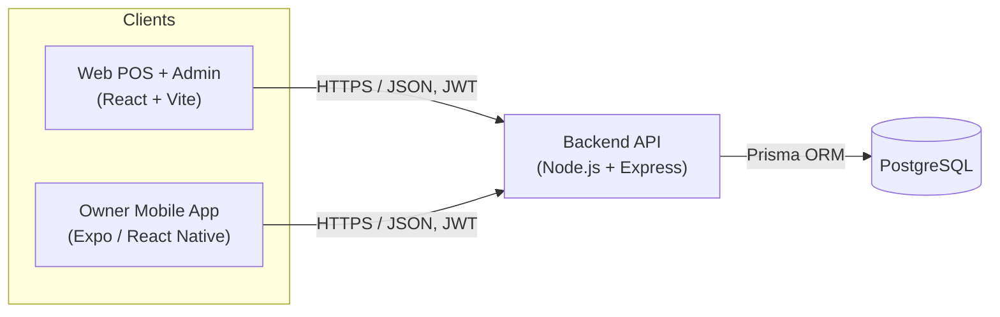

# Architecture

## Overview

The system is three separate applications sharing one backend API and one database:



Everything a client does — ringing up a sale, adjusting stock, reading a report — goes through the same API and the same validation, authorization, and business logic. Neither client talks to the database directly. That's what keeps the numbers consistent: the mobile app's "yesterday's revenue" and the web app's "yesterday's revenue" are the exact same query, run through the exact same code path.

## Why three apps, one API

- **Web app (`/frontend`)** is where checkout actually happens (barcode scanning, cart, cash/card tender, receipt) and where day-to-day store management lives (products, stock, categories, suppliers, users, settings). This is the terminal a cashier or manager sits at.
- **Mobile app (`/mobile`)** is deliberately *not* a second checkout terminal. It's the owner/manager's pocket dashboard: today's numbers, trends, and "what do I need to order" — the things you want to check from the stockroom, from home, or on your phone between customers. Restricting its scope kept it focused and let it skip a whole category of hardware-integration problems (barcode scanner input, cash drawer triggers) that only matter at a fixed terminal.
- **Backend (`/backend`)** owns every rule that has to be enforced no matter which client is asking: who's allowed to do what, how a sale's totals are computed, what counts as "this week," what "low stock" means. Putting this in one place means a rule only has to be written — and tested — once.

## Backend structure

```
backend/src/
  app.js            Express app: middleware, route mounting (no listen() — see server.js)
  server.js         Starts the HTTP server
  config/env.js     Reads and validates process.env once at startup
  routes/           One file per resource; wires paths -> middleware -> controller
  controllers/      Thin HTTP layer: parse request, call a service, shape the response
  services/         Business logic (checkout math, reports, RBAC-relevant decisions)
  middleware/       auth (JWT verification), requireRole (RBAC), validate (zod), errorHandler
  validation/       zod schemas — the single source of truth for what a valid request looks like
  utils/            Pure, dependency-free helpers (money.js, dateRange.js, reorder.js, jwt.js)
  lib/prisma.js     The one shared PrismaClient instance
```

Request flow for every endpoint: **route → `requireAuth` → `requireRole` (if restricted) → `validate` (zod) → controller → service → Prisma → response**. A request that fails auth, role, or validation never reaches business logic.

### Why business logic lives in `utils/`, not just `services/`

`money.js`, `dateRange.js`, and `reorder.js` have zero dependencies — no Prisma, no Express, nothing async. That's deliberate: it's what makes them unit-testable with nothing but Node's built-in test runner (see `backend/tests/`), and it's what let the checkout math and the demo-data seed script (`prisma/seed.js`) use the *exact same* pricing and stock logic instead of two implementations that could quietly drift apart.

## Frontend structure

```
frontend/src/
  api/         axios instance + auth-token store + refresh-on-401 interceptor
  context/     AuthContext (current user, login/logout, session restore)
  components/  Reusable UI, grouped by feature (pos/, reports/, ...)
  pages/       One component per route (POSPage, ReportsPage, ProductsPage, ...)
  utils/       formatting helpers, chart color tokens
```

Routing and role-gating live in `App.jsx`: each route is wrapped in `ProtectedRoute`, which redirects to `/login` if there's no session and hides the route entirely if the logged-in user's role isn't in the route's allowed list (e.g. `/users` is ADMIN-only).

## Mobile structure

```
mobile/src/
  api/          Same pattern as the web app: axios client + tokenStore + refresh interceptor,
                adapted for expo-secure-store (async) instead of localStorage (sync)
  context/      AuthContext — same shape/behavior as the web app's, RN-flavored
  navigation/   RootNavigator (login vs. main app) + MainTabs (the 4 tabs)
  screens/      Dashboard, Reports, Reorder, Account, Login
  components/   StatCard, TrendBars, BarRanking, RangePicker — hand-built with plain
                Views/Text, no charting library (see "No chart library on mobile" below)
  utils/        Same formatting + chart-color tokens as the web app, kept in sync by hand
```

The mobile app intentionally mirrors the web app's `api/`/`context/` design rather than inventing a different pattern — the two token stores and two `client.js` files are near-identical, adapted only where the platform forces a difference (see below).

## Cross-cutting design decisions

**Auth: short-lived JWT + rotating refresh token.** The access token is a signed JWT, valid 15 minutes, sent as `Authorization: Bearer <token>` and never persisted to disk on either client — it lives in memory only. The refresh token is a long random value; the server stores only its SHA-256 hash (`refresh_tokens.token_hash`), so a stolen database dump doesn't hand out usable tokens. Every refresh **rotates**: the old token is marked revoked and a new pair is issued. If a revoked token is ever presented again, that's a strong signal it was copied and replayed by someone else — see `docs/SECURITY.md`. The web app persists the refresh token in `localStorage`; the mobile app persists it in `expo-secure-store` (iOS Keychain / Android Keystore), which is the meaningful upgrade a native app gets over a browser here.

**Server-authoritative pricing.** A checkout request from the web POS carries only `productId` + `quantity` per line — never a price. Every price, tax amount, and total is computed on the server from the current product record, inside `sale.service.js`. This isn't just tidiness: it's what stops a tampered client (or a replayed/edited request) from ringing up a $200 item as $2.

**Integer-cents money math.** All money arithmetic (`utils/money.js`) works in integer cents internally and only converts to/from decimal dollars at the boundary. This sidesteps the classic `0.1 + 0.2 !== 0.3` floating-point drift that, over thousands of transactions, would eventually make a receipt not add up.

**Timezone-aware reporting, built on `Intl` only.** "Today," "yesterday," "this week" are store-local-time concepts — a sale at 11:50pm shouldn't count toward the wrong day just because the server clock is UTC. `utils/dateRange.js` computes these ranges using only `Intl.DateTimeFormat` (no date library), verified correct across DST transitions in `dateRange.test.js`. Every report — trend, summary, top products, the mobile dashboard — resolves ranges through this one module, so "this week" always means the same thing everywhere.

**Audit trail, not just a running total.** `products.quantity_on_hand` is a running total for fast reads, but it is never the source of truth by itself: every change to it — a sale, a delivery, a manual correction, waste, a return — also writes a row to `stock_movements` recording what happened, how much, and who did it. A stocktake or a "why did this go negative" investigation reconciles against that table, not against memory of what should have happened.

**Snapshot pricing on sale items.** `sale_items` stores `product_name`, `unit_price`, and `tax_rate` as they were *at the moment of sale*, separately from the live `products` table. If you rename a product or change its price next month, every past receipt and every past report still reflects what the customer actually paid.

**No chart library on mobile.** The web app uses Recharts; the mobile app's charts (`TrendBars`, `BarRanking`) are hand-built from plain React Native `View`/`Text` with computed widths/heights. This was a deliberate scope trade-off: a React Native charting library adds real version-compatibility risk against a specific Expo SDK, and the two visualizations this app needs (a day-by-day bar trend, a ranked horizontal bar list) are simple enough to build correctly with flexbox alone. Both `frontend` and `mobile` keep an identical `utils/chartColors.js` with the same validated palette, so a chart means the same thing — same hue for "magnitude," same status colors — on either app.

## Where to look next

- **`docs/DATABASE.md`** — every table, its columns, and an ER diagram.
- **`docs/API.md`** — every endpoint, who's allowed to call it, and what it returns.
- **`docs/SECURITY.md`** — the auth/RBAC model in detail, and backup/restore notes.
