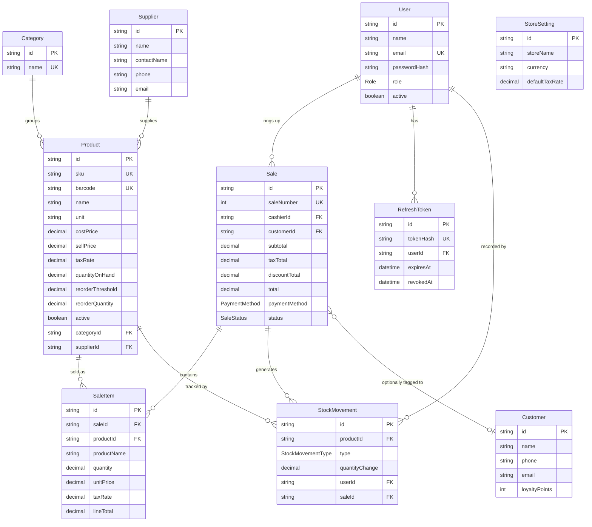

# Database

PostgreSQL, managed entirely through Prisma migrations — the schema in `backend/prisma/schema.prisma` is the single source of truth. You never hand-write SQL to create or change tables; `npx prisma migrate dev` generates and applies the migration for you (see the root `README.md` for the exact command).

Naming convention: fields are camelCase in Prisma/JS (`quantityOnHand`), and each maps to a snake_case Postgres column (`quantity_on_hand`) via `@map(...)`. That's the natural spelling for each ecosystem, and it's why the raw SQL in `report.service.js` (`reorderReport()`) reads like normal SQL instead of needing quoted mixed-case identifiers everywhere.

## Entity-relationship diagram

`StoreSetting` has no relations — it's a deliberate single-row table (the app always reads/writes the one settings record) and is left off the diagram's connecting lines for that reason.

## Tables

### `users`
Every person who can log in — cashiers, managers, admins. **Never hard-deleted**: a user with sale history is deactivated (`active = false`) instead, via `DELETE /api/users/:id`, which is implemented as a soft delete. Deleting the row would either cascade-delete real sales history or force `sales.cashier_id` to break — neither is acceptable for something a business needs for tax/audit purposes.

### `refresh_tokens`
One row per issued refresh token, storing only its **SHA-256 hash**, never the raw token. `revoked_at` is set on logout and on every refresh (rotation — see `docs/SECURITY.md`). Rows are cascade-deleted if the user is ever hard-deleted (which in practice only happens to a user with no sales, since `users` is otherwise soft-deleted).

### `categories`, `suppliers`
Simple lookup tables for organizing products and reordering. A product's category/supplier can be `null` (`onDelete: SetNull`) — deleting a category doesn't delete or orphan-block the products in it, it just leaves them uncategorized.

### `products`
The catalog. Quantities (`quantity_on_hand`, `reorder_threshold`, `reorder_quantity`) are `Decimal(10,3)` — three decimal places — specifically so produce sold by weight (e.g., `1.250` kg of bananas) is represented exactly, not rounded like a whole-unit product would be. Money fields (`cost_price`, `sell_price`) are `Decimal(10,2)`; `tax_rate` is `Decimal(5,4)` (e.g., `0.0825` = 8.25%). Like users, products are soft-deleted (`active = false`) once they have sale history, for the same audit reason.

### `stock_movements`
The audit trail. **Every** change to a product's stock — a sale, a delivery received, a manual correction, spoilage/waste, a customer return — writes one signed row here (`quantity_change`: positive for stock coming in, negative for stock going out) *in addition to* updating the running total on `products.quantity_on_hand`. This is what makes "why is this product's count what it is" answerable after the fact, and it's what a real stocktake reconciles against. Indexed on `product_id` and `created_at` for the stock-history view and time-ranged audits.

### `customers`
Optional. A sale can be tagged to a customer (for a loyalty-points running total) but doesn't need to be — walk-up checkout with no customer attached is the common case.

### `sales` / `sale_items`
`sales` is the receipt header (totals, payment method, cashier, timestamp, status); `sale_items` is the line items. `sale_items` **snapshots** `product_name`, `unit_price`, and `tax_rate` at the moment of sale, independent of the live `products` row — so renaming a product or changing its price next month never silently rewrites what an old receipt says the customer paid. `sale_number` is a separate human-friendly auto-incrementing integer (what you'd print on a receipt), distinct from the internal UUID `id`.

A sale is never hard-deleted. Voiding (`POST /api/sales/:id/void`, manager/admin only) sets `status = VOIDED` and records `void_reason`, and reverses the stock movements — it does not erase the record.

### `store_settings`
Single-row table (the app always uses the first/only record) for store name, address, currency, default tax rate, and receipt footer text.

## Referential integrity choices

These are deliberate per-relation choices in the schema, not defaults:

| Relation | On delete | Why |
|---|---|---|
| `Product → Category` / `Product → Supplier` | `SetNull` | Deleting a category/supplier shouldn't block or cascade into product data |
| `Sale → User (cashier)` | `Restrict` | A user with recorded sales can't be hard-deleted (soft-delete instead) |
| `SaleItem → Product`, `StockMovement → Product` | `Restrict` | A product with sale/movement history can't be hard-deleted (soft-delete instead) |
| `RefreshToken → User`, `SaleItem → Sale` | `Cascade` | These rows have no meaning without their parent |
| `Sale → Customer`, `StockMovement → User`, `StockMovement → Sale` | `SetNull` | Optional links — losing the customer/user/sale reference shouldn't destroy the record itself |

## Local access & backups

See `docs/SECURITY.md` for connecting with `psql`/Prisma Studio and for the backup/restore procedure (`pg_dump`/`pg_restore`).
